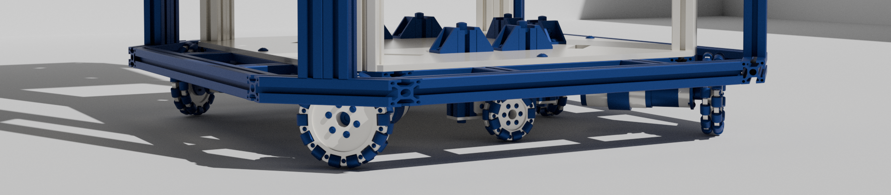
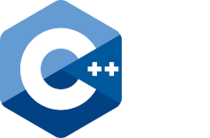
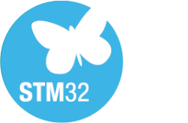

    

## About Me

✨ Greetings!

💻 Mobile robots, low-level software, internet, video games.

🐧 Long live free and open source software!

📫 Reach me at aftito.faturohim@gmail.com

## Tech Stack

    

 

    
    
    
    
    
    
    
    

