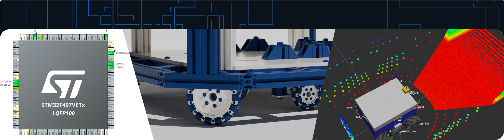

    

## Hi, I'm [Fatur](github.com/northnSouth)

🎓 Computer Engineering undergraduate at [Diponegoro University](https://undip.ac.id/).

💻 Mobile roboticist and low-level software engineer.

🐧 FOSS fanboy. Long live free and open source software!

📫 Reach me at aftito.faturohim@gmail.com. Feel free to chat!

## Skills

- Robotics with [ROS 2](https://github.com/ros2) and [Gazebo](https://gazebosim.org/home) for simulation.
- C++ and Python proficiency, uses Docker occasionally. 
- Familiarity with Debian-based Linux distributions, Mint daily driver.
- Embedded software with Raspberry Pi, STM32, Arduino, and NVIDIA Jetson.
